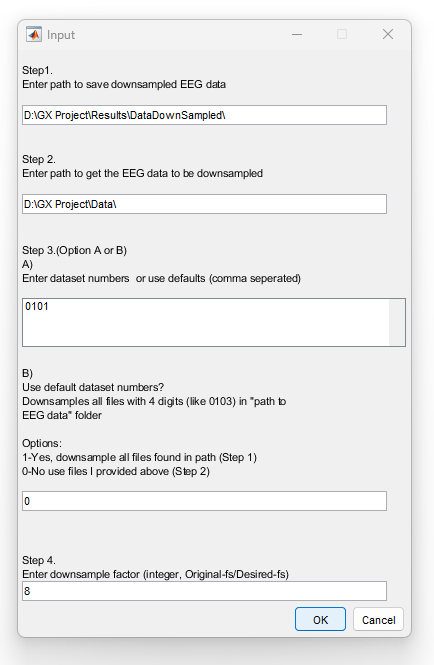

# Dataset of Concurrent EEG, ECG, and Behavior with Multiple Doses of transcranial Electrical Stimulation

This repository contains supporting code for the [GX dataset](https://zenodo.org/record/4456079#.YK8ak6hKiF5).
For an in-depth description of the dataset please see the accompanying dataset publication. **Please cite this work as**:


> Gebodh, N., Esmaeilpour, Z., Datta, A. et al. Dataset of concurrent EEG, ECG, and behavior with multiple doses of transcranial electrical stimulation. Sci Data 8, 274 (2021). https://doi.org/10.1038/s41597-021-01046-y


<p align="center">
  
</p>


## Contents
- [Description](#description)
- [Data availability](#data-availability)
- [Getting started](#getting-started)
   * [Right away](#right-away)
   * [From scratch](#from-scratch)
- [Data visualization and plotting](#data-visualization-and-plotting)
- [Downsampling](#downsampling)
- [Demographics](#demographics)
- [Acknowledgments](#acknowledgments)

<!-- toc -->


## Description

A dataset combining high-density electroencephalography (EEG) with physiological and continuous behavioral metrics during transcranial electrical stimulation (tES; including tDCS and tACS). Data includes within participant application of nine High-Definition tES (HD-tES) types targeted three brain regions (frontal, motor, parietal) with three waveforms (DC, 5Hz, 30Hz), with more than 783 total stimulation trials over 62 sessions with EEG, physiological (ECG or EKG, EOG), and continuous behavioral vigilance/alertness metrics.

### Experiment Overview


**Experiment Overview:** **(a)** Behavioral Task. **(b)** EEG and stimulation layout in 2D. **(c)** MRI-derived 3D head model with stimulation montage. **(d)** Task set-up. **(e)** Experiment 1 programmed block design with **(f)** trigger details. **(g)** Experiment 2 block design with **(h)** trigger details.  


#### Experiment 1: Example participant's data
<p align="center">

<p>
  
#### Experiment 2: Example participant's data
<p align="center">

<p>


## Data availability
##### What format is the GX dataset available in?
* Raw [EEG, ECG, EOG data](https://zenodo.org/record/4456079#.YOYCLuhKguW) in `.cnt` formant
* Raw [EEG, ECG, EOG data](https://openneuro.org/datasets/ds003670/versions/1.1.0) formated to comply with [BIDS](https://bids.neuroimaging.io/) standard where data are in `.set` format ([EEGlab](https://sccn.ucsd.edu/eeglab/index.php))
* Raw downsampled EEG, ECG, EOG data (1k Hz) in `.mat` format for [Experiment 1](https://zenodo.org/record/3840615#.YOYKfehKguU) and [Experiment 2](https://zenodo.org/record/3840617#.YOYKj-hKguU) (works with [MATLAB](https://www.mathworks.com/help/matlab/ref/load.html) and [Python](https://scipy-cookbook.readthedocs.io/items/Reading_mat_files.html))
* Raw behavioral [CTT data](https://zenodo.org/record/4456079#.YOYCLuhKguW) `.csv` format
* [Questionnaire data](https://zenodo.org/record/4456079/files/GX_Subject%20Info%20%26%20Behavioral%20Data.xlsx?download=1) in `.xlsx` format


## Getting Started

### Right away
##### What do I need to get started right away?
You can get started right away by using the downsampled `.mat` files linked to in the main data repository [see 'Extras' here](https://zenodo.org/record/3837213#.YK9ThahKjZQ). 
The `.mat` files are compatible with [MATLAB](https://www.mathworks.com/help/matlab/ref/load.html) and [Python](https://scipy-cookbook.readthedocs.io/items/Reading_mat_files.html) (other platforms have not been tested). Each of the files contains the ~70 min recording combined with the CTT data and information on the stimulation trials. 


##### What's in the dowsampled ``.mat`` files?
The ``.mat`` files contain a matlab structre that contains the following:
* DSamp
    * triggers <- These are all the labeled EEG/Stimulation start/stop triggers
    * EEGdata <- Contains the downsampled EEG/ECG/EOG voltage data dims: 35 channelss X ~4E6 samples
    * fs <- The downsampled sampling frequency of the data : 1000 Hz
    * fsOld <- The original sampling frequency of the data
    * time <- Time vector for the data. Should be 1 X ~4E6
    * label <- Contains the channel label information. BIP1= ECG, BIP2=EOG, RESP1= N/A
    * nchan <- The number of channels in the data
    * rate <- Redundant to fs, sampling rate of data
    * npt <- Number of data points ~4E6
    * Subj <- Subject and session that data belong to. I.e. 0302 - Subject 03 session 03
    * ptrackerPerf <- The CTT data deviation/ the behavioral data
    * ptrackerTime <- Time vector for the CTT data
    * ptrackerfs <- The sampling frequency for the CTT data 100 Hz.


###   From scratch
##### I want to get started with the raw data in `.cnt` format
To get started with the [EEG, ECG, EOG data](https://zenodo.org/record/4456079#.YOYCLuhKguW) in `.cnt` format, start with the folder set up below. Once everything is set up you can run either `GX_Exp1_CTT_GeneralAnalysis.m` to get results for Experiment 1 or `GX_Exp2_CTT_GeneralAnalysis.m` to get results for Experiment 2. Please be sure to adjust all the hardcoded paths accordingly. 


#### Folder set up
Generally the project folder is set up as below:

```
+GX
|--Analysis
    |--GX_Exp1_CTT_GeneralAnalysis.m
    |--GX_Exp2_CTT_GeneralAnalysis.m
    ...
|--Data
    +--0101 (Participant number: 01 and session number: 01)
        +--0101
            |--ptracker-0101.csv (Behavioral Data)
            |-- ptracker-summary-0101..txt
        |--GX_01_2019-09-24_15-45-53.cnt  (EEG, ECG, EOG data)
        |--GX_01_2019-09-24_15-45-53.evt
        |--MATLABfilestream0101924.mat
        |--MATLABfilestream0101924.txt
    +--0102 (Participant number: 01 and session number: 02)
    +--0103 (Participant number: 01 and session number: 03)
    +--0104 (Participant number: 01 and session number: 04)
    ... 
|--Documents
|--Results

```

#### File naming convention
The files are ordered by each subject/participant's session. For example participant 1's third session would be labeled 0103. Here "01" indicates the participant ID and "03" indicates the session number. Note that some participants returned to repeat the experiment and were assigned new participant IDs. 

Participants who repeated the experiment:

**Repeated sessions with different current intensities**
```
+--01:
   |--> Session 0101 was repeated as 0102
   |--> Session 0103 was repeated as 0106
   |--> Session 0104 was repeated as 0105   
  
```  
**Repeated sessions with same current intensities**
```
+--12: 
   +New assigned ID 19
   |--> Session 1201 was repeated as 1902
   |--> Session 1202 was repeated as 1901 
      
+--15:
   +New assigned ID 18
   |--> Session 1501 was repeated as 1802
   |--> Session 1502 was repeated as 1801 
      
+--21:
    +New assigned ID 25
    |--> Session 2101 was repeated as 2502 
    |--> Session 2102 was repeated as 2501
    +New assigned ID 26
    |--> Session 2101 was repeated as 2601 
    |--> Session 2102 was repeated as 2602
      
+--22:
    +New assigned ID 23 
    |--> Session 2201 was repeated as 2302
    |--> Session 2202 was repeated as 2301
    +New assigned ID 24
    |--> Session 2201 was repeated as 2401
    |--> Session 2202 was repeated as 2402

```
## Data visualization and plotting

<p align="center">
  
</p>


##### I want to look at individual stimulation trials
To pull out and look at all the stimulation trials for the whole study you can do so by running the ``GX_PullingDataIntoTrials_PlottingTopoplots.m`` script. This script runs through all the data and pull out the EEG and CTT data into 30 sec Pre During Post stimulation trials. Please pay attention to the code flags which allow for the plotting and saving for different things.

All trials for both experiments are indexed on [Figshare](https://figshare.com/authors/Nigel_Gebodh/8797454).

* The trials plotted as **timeseries, spectrograms, and behavioral CTT**, similar to below, can be found [here](https://figshare.com/articles/figure/Dataset_of_Concurrent_EEG_ECG_and_Behavior_with_Multiple_Doses_of_transcranial_Electrical_Stimulation-_Stimulation_Trials_Timeseries/14810442)

<p align="center">

</p>


* The **PSD's** across trials, similar to below, can be found [here](https://figshare.com/articles/figure/Dataset_of_Concurrent_EEG_ECG_and_Behavior_with_Multiple_Doses_of_transcranial_Electrical_Stimulation-_Stimulation_Trials_PSD/14810517)

<p align="center">

</p>


* The **topoplots** during stimulation across trials, similar to below, can be found [here](https://figshare.com/articles/figure/Dataset_of_Concurrent_EEG_ECG_and_Behavior_with_Multiple_Doses_of_transcranial_Electrical_Stimulation-_Stimulation_Trials_Topoplots/14810478)

<p align="center">

</p>


## Downsampling
##### The files are too large how do I downsample them?!
Since the raw data are sampled at 2 kHz moving and loading files may become difficult on some machines. If you would like to downsample the data please use the ```GX_DataDownSample.m``` script. The script features a GUI that allows you to paste in file names, locations, and downsample factor according to how much you want to downsample the data. The script assumes the file structure shown above.  

<p align="center">

</p>

## Demographics
##### I want to explore the demographic data of the study
To pull in and look at the demographic data of the study you can use the ``GX_PlottingDemographicInfo.m`` script. This pulls in the tabulated demogrpahic data that were compiled over the course of the study and plots them similar to below. 

<p align="center">

</p>


## Acknowledgments

Portions of this study were funded by X (formerly Google X), the Moonshot Factory. The funding source had no influence on study conduction or result evaluation. MB is further supported by grants from the National Institutes of Health: R01NS101362, R01NS095123, R01NS112996, R01MH111896, R01MH109289, and (to NG) NIH-G-RISE T32GM136499.
